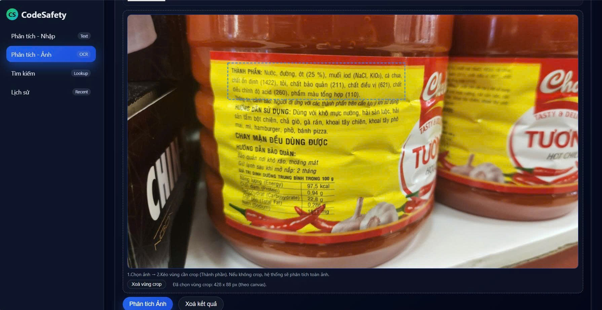
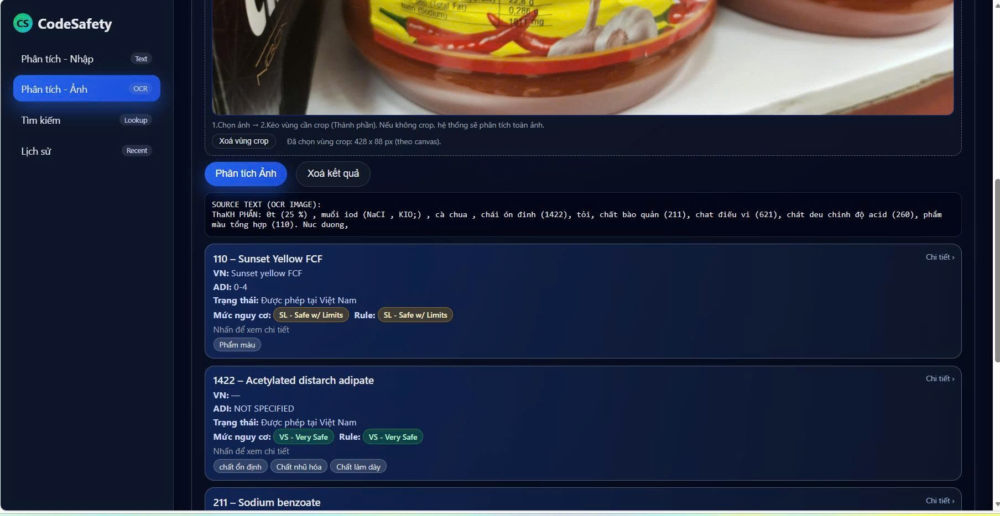

    CodeSafety/
    │
    ├── 📁 data/
    │   ├── 📁 processed/               
    |   │   ├── ecode_dict_clean.csv    # File hỗ trợ cho module NLP
    |   │   └── ecodes_master.csv       # File csv chuẩn hóa để import vào Neo4j
    |   |
    │   └── 📁sample_inputs/            # Ảnh test
    │
    ├── 📁 ontology/
    │   ├── schema.json                  # Định nghĩa lớp, quan hệ, constraint
    │   └── mapping_notes.md             # Ghi chú mapping từ CSV → Ontology
    │
    ├── 📁 rules/
    │   └── risk_rules.yaml              # Bộ luật cảnh báo mức độ an toàn
    │
    ├── 📁 src/
    │   ├── __init__.py
    │   ├── ocr_module.py                # OCR (EasyOCR, Tesseract)
    │   ├── nlp_module.py                # Chuẩn hóa tên phụ gia, nhận dạng E-code
    │   ├── neo4j_connector.py           # Hàm kết nối và truy vấn Neo4j
    │   ├── rule_engine.py               # evaluate_rules() 
    │   ├── analyze_ecode.py             # Hàm chính: combine OCR + NLP + KG + Rule
    │   └── utils.py                     # Các hàm phụ: đọc YAML, logging, v.v.
    │
    ├── 📁 api/
    │   ├── main.py                      # FastAPI — cung cấp endpoint /ecode/analyze
    │   ├── schemas.py                   # Định nghĩa các đối tượng cho API
    │   └── auth.py                      # Xử lí đăng nhập
    │
    ├── 📁 app_ui/
    │   ├── web/                         # Giao diện web (HTML/CSS/JS hoặc Flask)
    │   └── mobile/                      # Giao diện Flutter (nếu làm đa nền tảng)
    │
    ├── .env                             # File chứa các biến để kết nối với Neo4j
    ├── .gitignore
    ├── load_data.py                     # Import data vào Neo4j
    ├── README.md                        # Giới thiệu tổng quan dự án
    └── setup_env.bat / setup_env.sh     # Script tạo môi trường ảo & cài thư viện

